Pleae note that this document is out of date and does not depict the current build process for eclipse.

Building the Heatseq Tool in Eclipse
-------------------------

**Section 1: Eclipse Setup**

1.  Download the current Eclipse IDE for Java Developers from http://www.eclipse.org/downloads/.  
2.  Install Eclipse by unzipping the downloaded file into the desired install location (Recommended: C://Eclipse/Juno/).  Note:  If you install in Program Files you may have to run as Admin to get plugins to install correctly. 
3.  Run eclipse by double clicking the eclipse.exe file (sample location: C://Eclipse/Juno/eclipse/eclipse.exe).  You may want to right click the eclipse.exe file and “Run as Administrator” if you run into issues installing plug-ins. 
4.  Create a workspace by browsing to the desired location for the heatseq code when the “Select a workspace” dialog appears (Recommended:  C://Eclipse_Workspaces/heatseq_workspace). 
5.  Install the EGit plug-in by clicking “Help”>>”Install New Software…” from the main menu within Eclipse.   Add http://download.eclipse.org/releases/juno to the "Work with" text box and "git" in the type filter textbox and hit return:     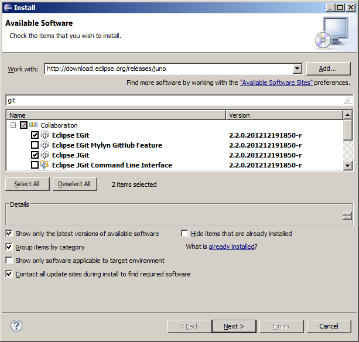  Then select and install:
  1. Eclipse EGit
  2. Eclipse JGit
6.  Install the m2e-jaxb2-connector.
  1. Click on Help>Install New Software.  Type the following into the “Work with” drop down box: 
http://m2e-jaxb2-connector.eclipselabs.org.codespot.com/hg.update/org.eclipselabs.m2e.jaxb2.connector.update-site/   Click the “Add…” button.
  2. Type an arbitrary name in the “Name” textbox when the “Add Repository” dialog appears and click the “OK” button:   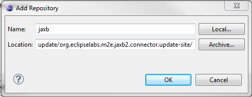 
  3. Make sure the m2e-jaxb2-connector is selected and click the “Next>” button:    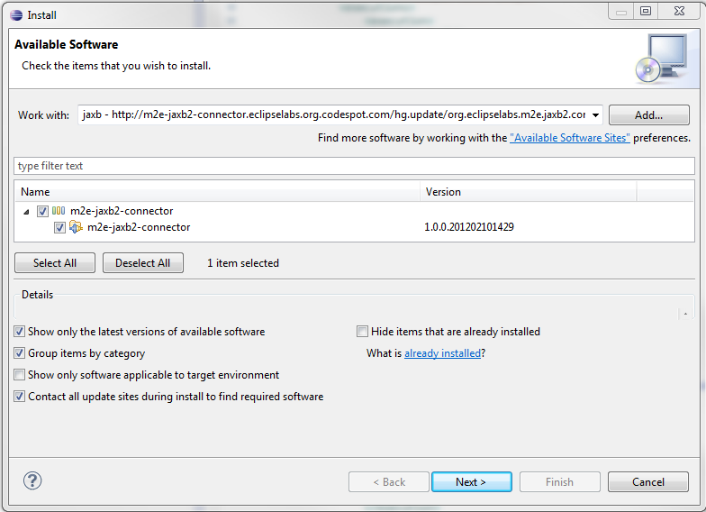 
  4. An “Install Details” panel will appear, click the “Next>” button.    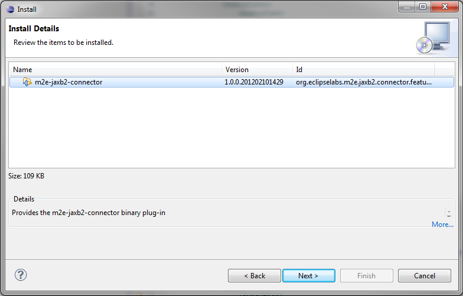 
  5. Make sure the “I accept the terms of the license agreement” radio button is selected and click the “Finish” button.    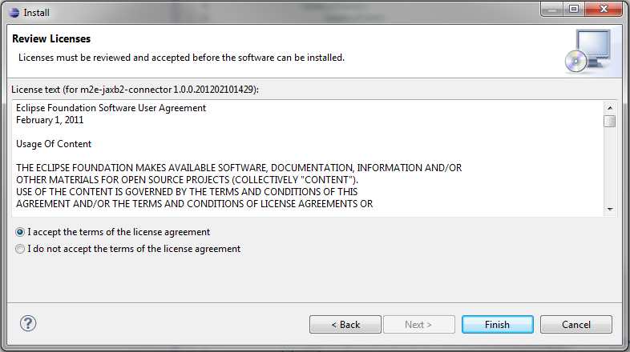 
  6. After the connector is installed you will be prompted to restart eclipse, comply.
7. Set a java 1.7 jdk in Eclipse as the default by clicking “Window”>>”Preferences” from the main menu.  Open the “Java”>>”Installed JREs” panel.  If there is not a jdk1.7 listed, add one by clicking the “Add...”  button.   Select “Standard VM” and click “Next”.   Click on the “Directory…” button and browse to an installed 1.7 jdk (For example: C:\Program Files\Java\jdk1.7.0_26) and click the “OK” button in the “Browse For Folder” dialog.  Click the “Finish” button in the “Add JRE” dialog.  Make sure that the 1.7 jdk has its checkbox selected and click “OK”.    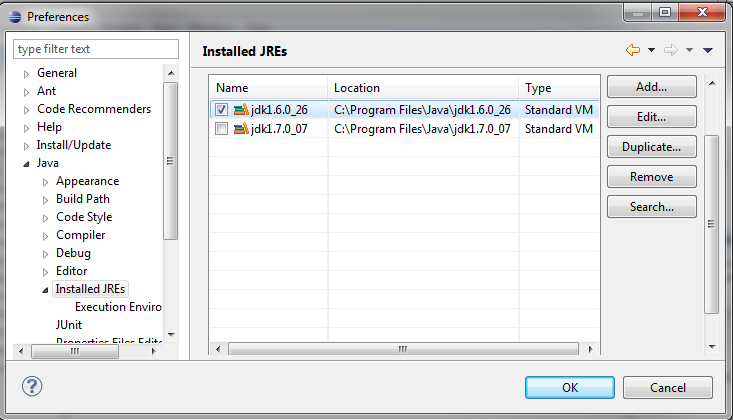  

**Section 2: Clone the GitHub repository**

1. In Eclipse, open the Git Repository Exploring perspective by clicking "Window">>"Open Perspective">>"Other" from the main menu.  Select the "Git Repository Exploring" perspective and click "Ok".
2. Click on the “Clone a Git repository” link or toolbar button:   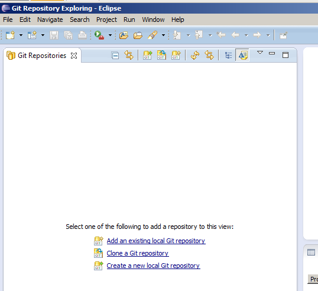  
3. In the "Clone Git Repository" dialog, select ‘URI’ and then click "Next".
4. On the "Source Git Repository" screen, enter https://github.com/NimbleGen/bioinformatics.git as the URI.  Enter your GitHub username and password, optionally checking "Store in Secure Store" if you want Eclipse to remember this information.   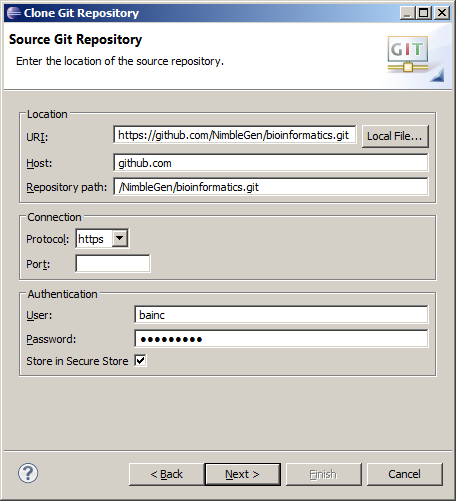    Then click "Next".
5. On the "Branch Selection" screen, make sure the "master" branch is selected, then click "Next".
6. On the "Local Destination" screen, choose a folder for the local directory or accept the default.   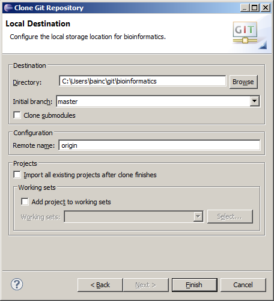     Then click "Finish".

**Section 3: Import projects into Eclipse**

1. In Eclipse, import the projects by clicking "File">>"Import">>"Maven" and selecting “Existing Maven Projects”.  Click "Next".
2. On the "Maven Projects" screen, set to the local directory you chose as the "Local Destination" when cloning the GitHub repository to be the "Root Directory":   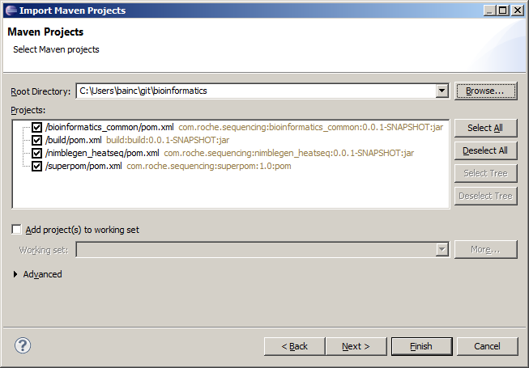   You should see four projects.  Make sure they are all selected and then click "Finish".

**Section 4: Set up code formatting in Eclipse**

1. In Eclipse, open "Window">>"Preferences" and select "Java">>"Code Style">>"Formatter".  Under the "Active profile:" text box click the "Import" button and select the eclipse_formatting_v1_0.xml file in your "Local Destination"'s superpom directory:   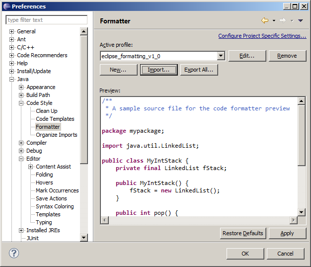   Click "Apply".
2. Under "Window">>"Preferences" select "Java">>"Editor">>"Save Actions" and check the check boxes next to "Perform the selected actions on save", "Format source code", and "Format all lines":   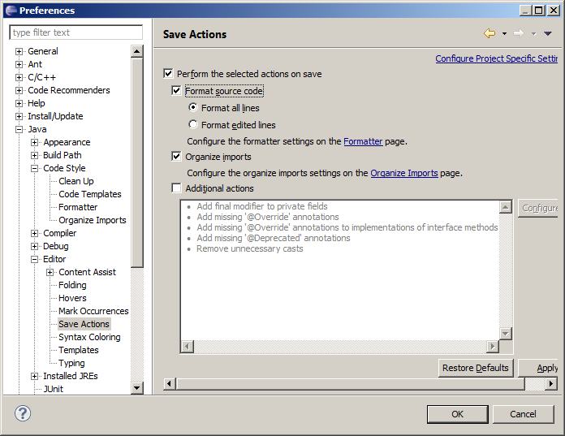   Click "Apply" and then "OK".

**Section 5: Build the Heatseq executable**

1. In Eclipse, switch to the Java perspective by clicking "Window>>""Open Perspective">>"Java (default)".
2. In the "Package Explorer" view, right click on "build">>heatseq_commandline">>"pom.xml" and select "Run As">>"Maven Install":  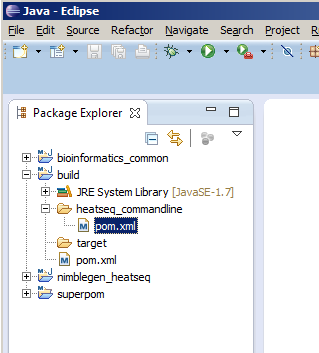   
3. The "Console" view will show the build progress.  When the build has completed the standalone .jar file will be in your "Local Destination" directory under nimblegen_heatseq/target/nimblegen_heatseq-0.0.1-SNAPSHOT-jar-with-dependencies.jar.
